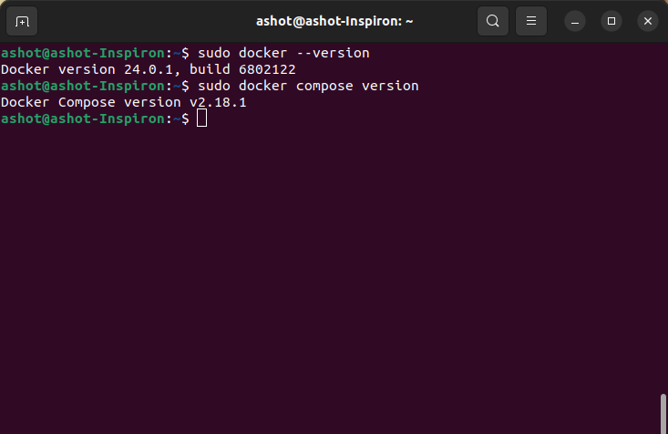

# Homework for the intro part:

Here is the version of the Ubuntu that I installed with my Windows as Dual Boot:
\
[ubuntu_version](screenshots/ubuntu_version.png) 
\

Here are the versions for the docker and docker compose
\
[docker_docker_compose](screenshots/docker_docker_compose.png) 
\

I used the instructions from the official documentation to install the docker and docker compose.\
Install using the apt repository\
Before you install Docker Engine for the first time on a new host machine, you need to set up the Docker repository. 
Afterward, you can install and update Docker from the repository.\
Set up the repository
Update the apt package index and install packages to allow apt to use a repository over HTTPS:

$ sudo apt-get update\
$ sudo apt-get install ca-certificates curl gnupg

Add Docker’s official GPG key:

$ sudo install -m 0755 -d /etc/apt/keyrings\
$ curl -fsSL https://download.docker.com/linux/ubuntu/gpg | sudo gpg --dearmor -o /etc/apt/keyrings/docker.gpg\
$ sudo chmod a+r /etc/apt/keyrings/docker.gpg

Use the following command to set up the repository:

$ echo 
  "deb [arch="$(dpkg --print-architecture)" signed-by=/etc/apt/keyrings/docker.gpg] https://download.docker.com/linux/ubuntu 
  "$(. /etc/os-release && echo "$VERSION_CODENAME")" stable" | \
$  sudo tee /etc/apt/sources.list.d/docker.list > /dev/null

Install Docker Engine
Update the apt package index:

$ sudo apt-get update

Install Docker Engine, containerd, and Docker Compose.\
To install the latest version, run:

$ sudo apt-get install docker-ce docker-ce-cli containerd.io docker-buildx-plugin docker-compose-plugin

Verify that the Docker Engine installation is successful by running the hello-world image.

$ sudo docker run hello-world

This command downloads a test image and runs it in a container. When the container runs, it prints a confirmation message and exits.
